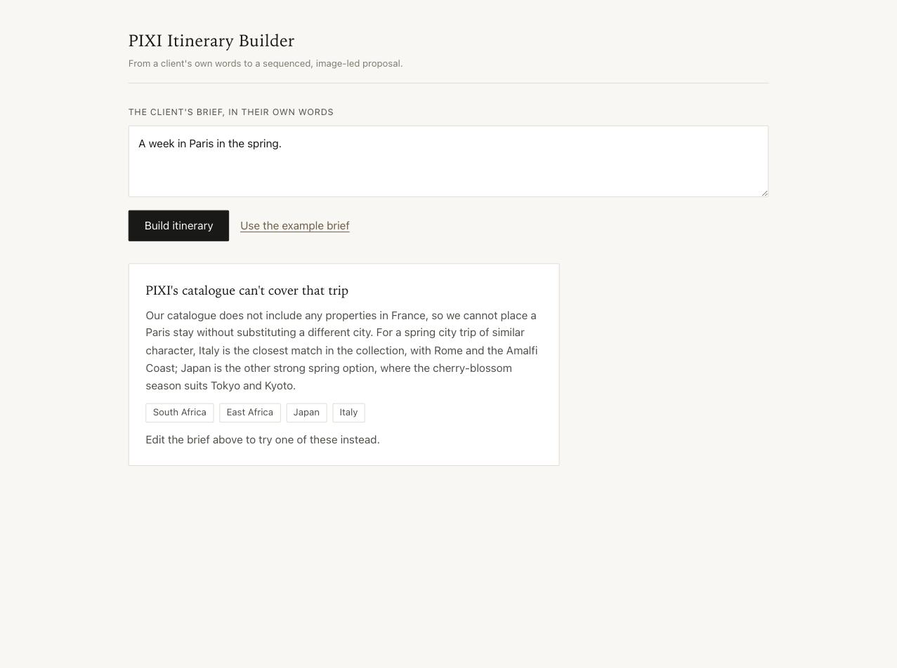
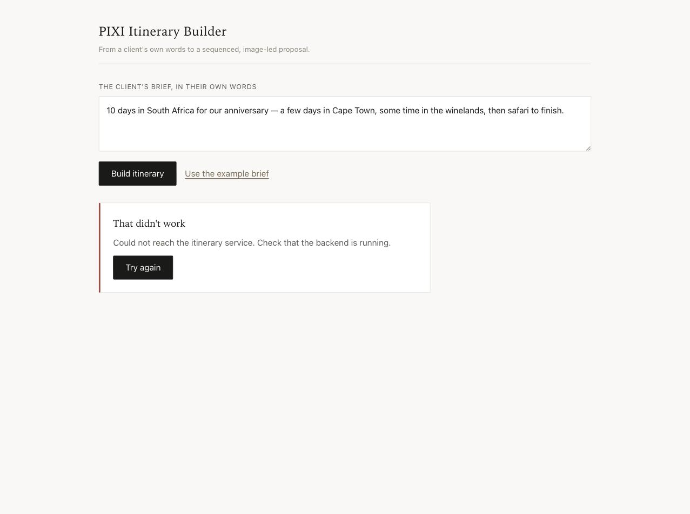
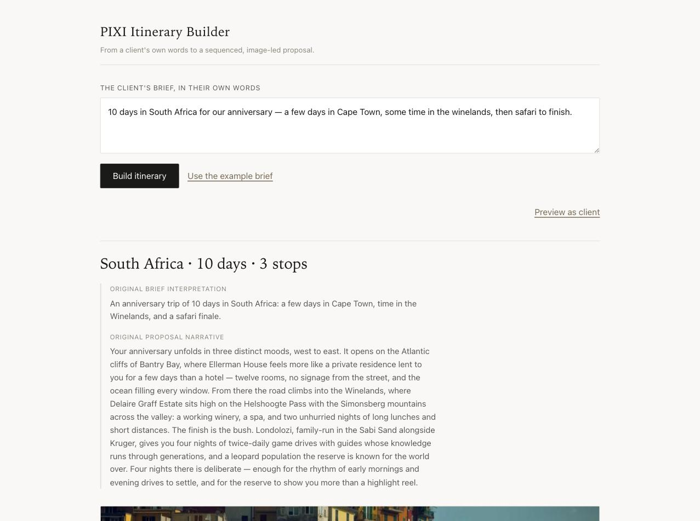

# Build Log

Chronological journal of how the PIXI Itinerary Builder was built —
decisions, corrections, and time spent. Written as work happens rather
than reconstructed afterwards.

Time entries are marked _pending_ where elapsed time was not recorded.

---

## Session 1 — Problem exploration and planning

**Date:** 2026-09-06
**Time:** ~2h

### Inspected the supplied materials

Read the assignment brief, the repository README, `data/schema.md`,
`data/hotels.json`, `data/validate.py`, and `data/README.md` before
proposing anything.

Ran the supplied validator:

```bash
python3 data/validate.py
# OK: 12 hotels across 5 countries — all valid.
```

Notable observations from the dataset itself:

- 12 properties across five countries, but effectively **four coherent
  regions**: South Africa; East Africa (Kenya and Tanzania, which pair as
  one cross-border circuit); Japan; Italy.
- Image counts vary — 3, 4 and 5 all occur — so any layout assuming a
  fixed count would break.
- `access_notes` is present on every property and is specific, human
  written, and publishable as-is.
- The local interpreter is Python 3.9.6, and `validate.py` already relies
  on PEP 585 builtin generics, so 3.9 is a real floor rather than a
  defensive guess.

### Decisions

**FastAPI over Django.** The brief permits either. Pydantic gives
schema-validated model output and the API contract from a single
definition, which is exactly what the architecture needs. Django's ORM,
admin and auth would go unused.

**No vector search.** A 12-hotel catalogue fits in a prompt. Embeddings
and a vector store would be infrastructure performing sophistication
rather than delivering it. Recorded as a timebox decision, not a claim
that retrieval is wrong at PIXI's real scale.

**Semantic planning separated from deterministic facts.** The model owns
interpretation, selection, sequencing, night allocation and language, and
may emit planning values such as nights per stop. Derived prices,
distances, durations and totals come from deterministic Python or supplied
dataset fields. Enforced structurally: the response schema carries no
price, distance or duration fields.

**One initial LLM planning call.** It may return both the interpreted
brief and the proposed plan. Splitting into separate parse and plan calls
was considered and deferred — it doubles latency for a benefit we have not
yet demonstrated we need.

**Duration and Day N, not calendar dates.** The dataset supports no
seasonality, availability, or date-dependent pricing, so calendar logic
would imply precision the data cannot back.

### Corrections to the initial AI-generated plan

These are the points where the first proposal was changed on review.

**Persistence removed from the core MVP.** The initial plan included a
JSON-file store so share links would genuinely work. On review, the
assignment does not require persistence, and it drags in identifiers,
serialisation and file lifecycle for a requirement we added ourselves. The
client view became an in-app read-only preview. A persistent share link is
a stretch goal if time remains.

**Editing reduced from three controls to two.** The initial plan proposed
change nights, replace hotel, and change room category. Room category adds
little signal for the core product thesis — that AI proposes and the
designer retains control — so the MVP keeps **change nights** and
**replace hotel** only. Consequence: `rooms[].rate_delta` goes unused, and
that is stated explicitly rather than left to look like an oversight.

**Testing scope loosened.** The initial plan said "unit tests on the
deterministic engine only, nothing else", which was too absolute. Final
position: unit-test the deterministic domain logic, manually verify the
complete end-to-end journey, add a cheap API happy-path test if
inexpensive, and treat frontend automated tests as optional.

**Contract wording corrected.** The initial plan described "one shared
`Itinerary` type across backend and frontend". There is no shared type —
there are two representations kept in sync by hand. Restated: the backend
Pydantic schemas are the canonical API contract, mirrored manually in
TypeScript for the MVP.

### The transfer-routing correction

The most consequential change, and a real example of AI accelerating
exploration while human review changed the engineering outcome.

**What AI proposed.** The initial architecture included a transfer engine:
haversine distance between consecutive stops, transport-mode inference
from distance and airport codes, duration estimates, and a mock transfer
rate card feeding into the total price. It was plausible and
self-consistent, but the data showed the abstraction itself was wrong.

**The challenge.** Does this actually improve the product, or is it
engineering for its own sake? The brief asks for an itinerary product, not
a route planner, and explicitly permits mocked or estimated data where a
real integration would otherwise be needed.

**What re-inspection of the data showed.** Reading every `access_notes`
value made the answer clear — inferred routing would have *contradicted*
the supplied information on real legs in this catalogue:

- *Giraffe Manor → Angama Mara.* Both list `NBO` as nearest airport. A
  "same airport means road transfer" rule is flatly wrong; the supplied
  notes describe a scheduled light aircraft from Nairobi Wilson.
- *andBeyond Ngorongoro → Singita Grumeti.* Both list `JRO`, 168 km apart
  in a straight line, connected by a bush flight the notes call *"Not
  road-accessible for guests."* Yet Ngorongoro itself is reached from
  Kilimanjaro by a four-to-five hour road transfer. Similar distances,
  opposite modes — distance does not determine the answer.

  *(Corrected: this entry originally said 110 km, a figure never computed.
  The great-circle distance is 168 km, and Giraffe Manor → Angama Mara is
  199 km. The original claim that any sane threshold would call the second
  leg a drive was wrong as well as unmeasured — a low threshold would in
  fact classify both correctly. The real reason inference fails is the road
  transfer above.)*

Patching these would mean encoding enough exceptions that the computation
is decoration over a lookup table — while producing numbers less accurate
than the strings already in the dataset.

**Decision.** The synthetic routing engine was removed. Haversine,
mode inference, duration estimation and transfer pricing are all out.
Transfer information stays grounded in `nearest_airport`, `access_notes`,
and origin/destination hotel facts. Narrative may reference that a
transfer exists, but specifics come from the supplied field rather than
generated prose.

**Why this is the right call.** *"We surface the supplied routing rather
than simulating a logistics engine; in production this is a routing or
travel-logistics integration"* is a stronger position than defending
invented precision — particularly to an audience who knows this domain far
better than we do. It also kept the remaining timebox on hardening and
visual quality, which is where a DAM company will actually look.

### `AGENTS.md` review

The working agreement was split into **Invariants** (true regardless of
scope) and **Current MVP Scope** (time-boxed and revisable). "No
persistence" had been carrying the same weight as "no hallucinated hotels",
which is how a timebox decision quietly becomes a claimed architectural
position.

Three of the review's own recommendations were rejected:

- *"The LLM must not emit these values at all"* — too broad. Planning
  values such as stop nights are legitimately model-owned. Narrowed to
  derived prices, distances, travel durations and calculated totals.
- *"`access_notes` verbatim, never paraphrased"* — too rigid for readable
  client-facing copy. Supplied data remains the source of truth, and
  narrative may paraphrase without introducing specifics the field does not
  contain.
- *"One repair attempt, then a deterministic fallback"* — promised
  behaviour that had not been designed. Corrected to a graceful,
  recoverable error state.

---

## Session 2 — First commit and the contract review

**Date:** 2026-09-06
**Time:** ~1.25h

### A verification pass before committing

Rule applied to a prose-only commit: every falsifiable claim must have a
command that proves it.

It caught a fabricated statistic. An AI-written passage claimed four images per
property; counting gives 46 across twelve — three with 3, eight with 4, one
with 5. Plausible, adjacent to the truth, and wrong. Re-reading would have
confirmed it; only counting caught it. It became invariant §10: layout is
driven by the image list, never a fixed count. The model may judge, but figures
come from the data.

Also fixed:

- A stale `§13` cross-reference left by renumbering `APPROACH.md`.
- An `ANTHROPIC_MODEL` default in `README.md` that no code implements.

First commit `fe3769c` — 11 files.

### Days are not nights

Found while reviewing `AGENTS.md` against the agreed API contract, before any
schema code was written.

**Original rule.** Invariant 7 read *"Nights across stops sum to the requested
trip duration"*, and the contract carried a single `duration_nights` figure.

**Challenge.** A ten-day trip is not ten nights. Treating the client's stated
figure as a night count silently equates two different units.

**Evidence.** The dataset prices per night, so the error is not cosmetic: a
ten-day brief priced as ten nights overstates accommodation by a full night —
at Londolozi's $1,800 rate, $1,800 on a client-facing figure, in a domain where
the distinction is standard practice. Nothing in the repository or the
assignment supported the equation.

**Final decision.** Trip length is a value plus a unit, normalised
deterministically: N days → N − 1 accommodation nights; N nights → N nights.
Stop nights sum to the accommodation-night total, never the day count.

**Why.** One unit runs through pricing, validation and day numbering while the
client's own words survive for display.

Same pass: `trip_region` named and distinguished from the dataset's
sub-national `region`, hotel replacement constrained to one region, unsupported
briefs defined as HTTP 200 outcomes. `python3 data/validate.py` passes.

---

## Session 3 — Backend domain layer

**Date:** 2026-09-07
**Time:** ~6h

### Slice: catalogue, contract, itinerary logic

Built

- `app/catalogue.py` — the supplied dataset loaded once, frozen dataclasses,
  explicit country → `trip_region` map, fail-loud on an unmapped country.
- `app/schemas.py` — the canonical contract. Planner models set
  `extra="forbid"`, so a model emitting a price or a duration is a schema
  error rather than a field silently dropped.
- `app/itinerary.py` — normalisation, collected domain validation, and
  deterministic construction. No LLM, no environment, no HTTP.

Decision

- The catalogue is stdlib frozen dataclasses rather than Pydantic models.
  `data/validate.py` already owns supplied-data validation, so validating
  again on load would duplicate it. An experiment confirmed the dataclass
  nests in a Pydantic response model without copying, so there is one hotel
  representation rather than two and no converter.

Verification

- 61 tests pass (7 catalogue, 20 schema, 34 itinerary).
- `python3 data/validate.py` passes.

### Slice: planner and API

Built

- `app/planner.py` — the live Anthropic path. Structured output via
  `messages.parse`, so the Pydantic models are the schema; one repair
  attempt on invalid output, then a recoverable error. No fixture fallback.
- `app/main.py` — `/api/itineraries`, `/api/itineraries/recompute`, and a
  health route reporting catalogue size and whether a key is configured.

Verification

- One real call on the worked-example South Africa brief succeeded first
  attempt: 10 days read as 10 days, 9 accommodation nights, three stops, no
  violations, no repair. Baseline latency **16.96s**, unmitigated for now.
- 88 backend tests pass; `python3 data/validate.py` passes.
- That response is captured at
  `backend/tests/fixtures/south_africa_anniversary_planned.json` for tests
  and frontend development. No production code path reads it.

### Recompute must not carry a trip length it does not own

**Original proposal.** `RecomputeRequest` would carry the full
`TripLength(value, unit)`, and stop nights would have to sum to the
accommodation nights it implied — the same rule as generation.

**Challenge.** That makes the primary edit control fail almost every time it
is used. On a ten-day trip with stops of 3/2/4, moving Cape Town from three
nights to four gives a sum of ten against nine expected, and recompute
returns 422. Forcing a compensating decrease elsewhere is not the gesture a
designer is making: adding a night means the trip got longer.

**Evidence.** The first fix — derive the length from the stop sum, ignore the
client's value — left the request carrying a field the backend discards, which
is the kind of quiet mismatch `extra="forbid"` exists to prevent. The second
version then reintroduced the days/nights conflation that invariant 7 was
written to stop: bounding the sum at 30 nights is wrong for a day-stated trip,
because 30 accommodation nights is a valid 30-night trip but an invalid
31-day one.

**Final decision.** `RecomputeRequest` carries `trip_length_unit` only.
Accommodation nights are derived from the edited stop sum; the stated value is
derived from those nights with the original unit preserved. The bound is
applied to the *derived stated value*, not to the night count, so
`MAX_TRIP_LENGTH` keeps one meaning regardless of unit. The nights-total check
remains on the generation path, where the model must respect the length it
read from the brief.

**Why.** The client can no longer send a value the backend ignores, the
day/night distinction holds on both paths, and "add a night" does what a
designer expects. Boundary tests pin all four cases: 29 nights + days valid,
30 nights + days rejected, 30 nights + nights valid, 31 nights + nights
rejected.

### No field in the API may look like a routing claim

**AI proposal.** Each stop would carry an `Arrival` block with
`from_airport`, `to_airport`, `access_notes`, and a derived
`requires_flight` boolean set when the two airport codes differed.

**Challenge.** `requires_flight` is inference, not a supplied fact — a
leftover from the routing engine that survived its removal. Then, once that
was cut: even a bare airport pair can be read as a route or a transport
claim, which is the same failure in quieter form.

**Evidence.** The legs that killed the routing engine kill this too.
Giraffe Manor and Angama Mara both list `NBO`, so differing-code logic
reports no flight, while the supplied notes describe a scheduled light
aircraft from Nairobi Wilson. Displaying an origin and destination airport
side by side invites a reader to draw exactly that wrong conclusion.

**Final decision.** `requires_flight` removed first; then `Arrival` removed
entirely. `Hotel` is already embedded whole in each stop and carries
`nearest_airport` and `access_notes` as supplied, so the second carrier
added nothing but a place for inference to reappear.

**Why.** No field in the public contract can now be mistaken for a claim
about how a guest travels, and the stop shape got smaller rather than
larger. The routing decision is enforced by the shape of the API rather
than by remembering it.

### The planner is given the supplied `access_notes`

**AI proposal.** Withhold `access_notes` from the planner prompt entirely.
If the model never sees *"approximately 45 minutes"*, it cannot paraphrase
it into narrative — the leak becomes structurally impossible rather than
prompt-policed.

**Challenge.** That removes real information. Access character drives
pacing: a property reached by light aircraft should not be a one-night
stop. Withholding it trades product quality for a guarantee we may not
need.

**Evidence.** Measurement, not argument. The additional prompt cost was
small relative to the planning signal, and the claim that `description`
already carries the signal is false: `andbeyond-ngorongoro`
and `singita-grumeti` are both fly-in with no access hint in their
descriptions, while `belmond-caruso-ravello` mentions a boat but is a road
transfer. The middle option — a hand-authored `access_character` label —
looked verifiable until `andbeyond-ngorongoro`, whose notes describe both a
four-to-five hour road transfer *and* a flight via Arusha. Any single label
there is a fact we invented about a property.

**Final decision.** Supply the full `access_notes`. The model may use it to
pace and may paraphrase it, but must not introduce specifics the field does
not contain, and must not derive route, distance, duration, transport mode
or feasibility. No `access_character` layer.

**Why.** Use the authoritative source directly rather than withholding
evidence or inventing a second interpretation of it. Confirmed on the first
live call: Londolozi was given four nights — the longest stop — with the
model's own reasoning that it is *"reached by charter flight… so it earns a
longer stay."* That pacing judgement is unavailable without the field. Every
transfer statement in the generated copy traced to supplied text, and no
fabrication appeared.

The guard is prompt-level, not structural: `rationale` and `narrative` are
free text, so an invented duration would pass. This sample was clean, which
is evidence rather than a guarantee.

### `southern-africa` renamed to `south-africa`

The `trip_region` slug was proposed as `southern-africa`. The catalogue
covers one country, so that name claims coverage of Botswana, Namibia and
Zimbabwe that the supplied data does not support — the invented-precision
problem, in an identifier. `AGENTS.md` already named the region "South
Africa"; the proposal contradicted it and had not been checked against the
file. Renamed to `south-africa`.

---

## Session 4 — Frontend

**Date:** 2026-09-07
**Time:** ~3.25h

### Slice: itinerary generation read view

**Time:** ~1.25h

Built

- Vite + React + TypeScript app: brief textarea, live `POST /api/itineraries`,
  loading state, and an image-led sequenced itinerary with per-stop subtotals
  and the accommodation total.
- `types.ts` mirrors the contract by hand. `api.ts` carries only the
  generation path — recompute arrives with the edit controls that need it.

Decision

- Generation and unsupported briefs both return HTTP 200 with no
  discriminator field, so the client narrows structurally on `"stops" in
  result`. One type guard, one place. An explicit discriminator would be the
  better long-lived contract; noted for productionisation rather than
  reopening the backend.

Verification

- Two live generations in a browser against the running backend: South Africa
  (9 nights from a 10-day brief, $10,850) and Japan. Loading, success and the
  supplied `access_notes` all render; no console errors.
- `npm run build` and `oxlint` clean; backend suite still 88 passing.

Correction

- The gallery CSS assumed five images. Hotels carry three to five, so a
  four-image property left one empty cell and a three-image property left
  two — the fixed-count assumption invariant §10 exists to prevent, asserted
  in a type comment and then broken in the stylesheet. Replaced the grid with
  a flex layout: hero at full width, the rest sharing one row evenly whatever
  their number. Verified at all three counts rather than reasoned about.

### Slice: itinerary editing

**Time:** ~1.25h

Built

- `RecomputeRequest` and `recomputeItinerary` — the API surface deliberately
  withheld from the previous slice until the controls needed it.
- Inline editing on each stop card: a nights stepper and a replacement
  dropdown drawn from `replacement_options`, with an explicit message where
  the region has no spare properties.

Verification

- Live in the browser: adding a night to a Kenya/Tanzania trip shifted every
  downstream day range, re-derived the trip length to 15 days, and moved the
  total to $24,700 across 14 nights. Replacement verified in Italy and Japan;
  the no-alternative state in East Africa and South Africa.
- `npm run build`, `oxlint`, 88 backend tests and `data/validate.py` all pass.

### Model-authored copy does not survive a deterministic edit

**AI proposal.** Carry the model's `rationale` and `narrative` through
recompute unchanged, so the itinerary keeps its explanatory copy without a
second model call.

**Challenge.** An edit can make that prose stale, or false. Replacing Hotel
de Russie with Belmond Hotel Caruso left the Rome rationale — *"the single
Rome property in the catalogue"* — attached to a hotel in Ravello. Adding a
night left a narrative still describing the old night count.

**Evidence.** The structured itinerary recomputed correctly in every case:
day ranges, trip length, subtotals and total. Only the free-text fields went
stale. Re-running the planner on each edit would fix the copy but costs the
measured ~17s per click and could quietly change unrelated planning
decisions.

**Final decision.** Keep edits deterministic and fast; do not re-run the
model. Instead, make the current itinerary authoritative and demote the
model's copy to historical context:

- The replaced stop's rationale is cleared, and the block renders only when
  it has content. No substitute copy — not workflow text such as "swapped in
  by the designer", which would leak process language into the client-facing
  view, and not the hotel's supplied `description`, which would sit where a
  rationale sits and borrow an authority the model never gave it.
- The itinerary heading is derived from current data — region, trip length,
  stop count — so it cannot go stale.
- `interpreted_brief` and `narrative` are kept but demoted and labelled
  *Original brief interpretation* and *Original proposal narrative*.

**Why.** Fast, controlled editing is the point of the deterministic layer,
and an absent rationale is truthful where a stale one is not — the model did
not choose this property. Labelling the model's prose was not enough on its
own: it was rendered as the headline, so a nine-day itinerary was titled "an
anniversary trip of 10 days" directly beneath a line reading 9 days. The
fix is not to discard all model-authored copy, but to reorder authority —
current state first, AI proposal as traceable history. In production these
are separable concerns, with an explicit "refresh the copy" action when a
designer wants
the prose rewritten.

### Slice: client preview

**Time:** ~0.75h

Built

- A view toggle on the itinerary. The client view drops the masthead, the
  brief form, every edit control, and the busy/error chrome, leaving the
  derived heading, the stops with their imagery, rationales, supplied access
  information and pricing.
- One boolean and a class, not a route or a second component tree.

Decision

- The top-level narrative is omitted from the client view entirely. It
  describes the proposal the model made, so after a designer edit it can
  contradict the itinerary beside it — and the client view is the one place
  where stale copy would reach someone who cannot tell. Designers keep it as
  labelled history. Deliberately unconditional: no `hasEdited` flag, because
  a rule that only sometimes applies is one an evaluator can catch out.

Verification

- Live in the browser: generated the worked-example brief, toggled to the
  client view and back. Confirmed the artefact carries three stops, imagery,
  `access_notes` and the $10,850 / 9-night summary with no edit affordances.
- `npm run build`, `oxlint`, 88 backend tests and `data/validate.py` pass.

---

## Session 5 — Submission hardening and verification

**Date:** 2026-09-08
**Time:** ~1h

### Final browser verification

Two paths had been written and unit-tested but never seen on screen — the
two an unscripted evaluator is most likely to reach first. Both were
exercised against a running build. **No defects found; no code changed.**

| Scenario | Expected | Observed |
|---|---|---|
| Supported brief | Grounded itinerary from PIXI data | South Africa, 9 nights over 3 stops, supplied imagery and access notes, $10,850 |
| Unsupported destination | Honest refusal, no substitution | HTTP 200 in 5s, named the four regions covered, offered alternatives without pretending Paris was served |
| Service unavailable | Recoverable error | Plain message and a Try again action; brief preserved |
| Retry | Recovery after restart | Returned to a valid itinerary |

Supported happy path, as the client sees it:


Unsupported destination:



Service unavailable:



Retry recovery:



### Clean-clone verification

Cloned the repository to a fresh directory and followed only `README.md`,
using nothing from the development environment to fill gaps.

Every documented step worked first time: `.env.example` was sufficient,
`pip install -r requirements.txt` resolved all seven pins on an empty venv,
`pytest` gave 88 passing, `uvicorn app.main:app --reload` started clean, and
`/api/health` returned the documented response — including
`planner_configured: true`, which confirms `.env` resolves from the
repository root rather than from a path that happened to exist locally.
`npm install` and `npm run dev` served on the documented port, and one live
generation succeeded end to end.

**No gaps found in the README.**

---

## Session 6 — Submission polish

**Date:** 2026-09-09
**Time:** ~1h

- Added an end-to-end demo GIF — itinerary generation, deterministic editing,
  and the client-facing preview — and embedded it in the README.
- Restructured and clarified the README so a first-time reviewer can follow
  the setup end to end, including where the backend and frontend environment
  configuration each live.
- Final submission review completed; the build journal is closed for
  submission.

---

## Session 7 — Post-submission fixes

**Date:** 2026-09-15 to 2026-09-16
**Status:** built on a `post-submission-fixes` branch, then fast-forwarded onto
`main` and pushed on 2026-09-16. The submitted commit is tagged `submission`
(`1d4fc75`), so the state the reviewer read stays identifiable.
**Time:** _pending_

Found while preparing for the technical review. Not part of the submitted
build or of the time summary below.

### Slice: an edited trip length is visible to the designer

Built

- `App.tsx` keeps the generated `trip_length` as `originalLength` on the
  itinerary view state. `ItineraryView.tsx` shows *"Now 11 days. Original
  plan: 10 days."* when an edit changes it. Style in `styles.css`.

Decision

- The baseline lives on the itinerary branch of the `View` union, so a new
  generation replaces it and every edit carries it forward unchanged. It is
  labelled *Original plan*, not *what the client asked for*: the generated
  length is the model's reading of the brief, and briefs with no duration are
  still unresolved (below). Designer view only, no API change, and no
  arithmetic in the frontend — both lengths come from the backend.

Verification

- `npm run build` and `oxlint` clean. In the browser against the real
  recompute route, with generation stubbed by fixed plans so no model was
  called: longer (11, then 12 days) and shorter (9 days) with the baseline
  held at 10; the notice removed on returning to 10; hidden in client preview
  and back on leaving it; reset by a new generation; nights unit (6 vs 5
  nights); singular wording (1 night vs 2 nights); a rejected edit to 31
  nights left the itinerary and its 30-vs-29 notice unchanged and showed the
  error.

### Slice: one error shape for request validation

Built

- A `RequestValidationError` handler in `main.py` returning `ErrorResponse`
  (422, `invalid_request`, `retryable: false`). Tests in `test_api.py`.

Decision

- The message is built from each error's field location and Pydantic message
  only, never the submitted value or context; invalid JSON gets a fixed
  sentence. Only request validation is translated — response validation and
  other exceptions still surface as programming errors. `api.ts` already
  displays `message` from an `ErrorResponse`, so the frontend needed no
  change.

Verification

- New tests: a 31-night stop (schema) and 30 + 1 nights (domain) return the
  same shape; empty and whitespace-only briefs are rejected without calling
  the planner; an extra `accommodation_total` is named without echoing its
  value; malformed JSON returns a readable message without echoing the body.
  Seen in the browser: *"stops.0.nights: Input should be less than or equal
  to 30"*.

### Slice: `TripLength` forbids extra fields

Built

- `model_config = ConfigDict(extra="forbid")` on `TripLength`. Tests in
  `test_schemas.py`.

Decision

- It was the one model nested in `PlannedOutput` that dropped unexpected keys
  instead of rejecting them, contrary to the rule stated in `schemas.py`. The
  planner's JSON schema now declares `additionalProperties: false` for
  `trip_length` as well.

Verification

- Both units still valid; `price` rejected as `extra_forbidden` directly and
  at `("trip_length", "price")` through `PlannedOutput`; the existing boundary
  tests pass unchanged. Not exercised against a live model call.

### Slice: a stale rationale falls back to the hotel description

Built

- `frontend/src/baseline.ts` (new): the generation baseline — trip length
  plus generated nights per hotel id — and `stopCopy`, which chooses what a
  card shows at render time. `App.tsx` stores the baseline in place of the
  earlier `originalLength`; `ItineraryView.tsx` passes each card its copy;
  `StopCard.tsx` renders it; the labels reuse the access-notes style in
  `styles.css`.

Decision

- Supersedes the earlier proposal to hide a stale rationale from the client.
  When a stop's nights differ from what was generated for that hotel, or its
  rationale is empty, the client sees the hotel's supplied `description`
  verbatim under *About the hotel*. The designer keeps the rationale, labelled
  *Written for the original 3 nights.*, and sees the description only when
  there is no rationale. The choice is made at render time: the description
  is never written into `stop.rationale` or sent back to the API. The
  baseline is keyed by hotel id and held in App state, because card keys
  include `day_from` and an edit to an earlier stop remounts later cards.
- Only hotel and nights are compared. This does not validate claims inside
  the text or references to other stops, and a rationale that never mentions
  its nights is replaced all the same — no prose is parsed.

Verification

- `npm run build` and `oxlint` clean. `baseline.ts` compiled with the
  project's `tsc` and checked with plain Node assertions: matching nights,
  4 and 2 nights, empty and whitespace-only rationale, a missing baseline, an
  empty description, and a baseline keyed by hotel.
- In the browser against the real recompute route, generation stubbed so no
  model was called: Ellerman House at 3 → 4 → 3 → 2 nights in both views,
  the night count and prices following each recompute; later cards keeping
  their rationale after remounting; a replacement showing the new hotel's
  description, and swapping back not restoring the cleared text; a new
  generation resetting the baseline in both directions for the same hotel
  (4 → 3 and 3 → 4 nights); a rejected 31-night edit leaving the 30-night
  card, its note and the length notice unchanged; an empty rationale, and an
  empty description (blanked in the stub process only), rendering no empty
  block. The client preview DOM contained neither a stale rationale nor
  *Written for*.

### Slice: the designer can rewrite a stale rationale

Built

- A *Review description* control beside a stale rationale in the designer
  view opens an editor pre-filled with the current text; *Save* sends it
  through the existing recompute route. `baseline.ts` now records, per hotel,
  the nights a rationale was written for and whether the model or the
  designer wrote it (`recordDesignerRationale`), and `App.tsx` stores that
  record only when the save succeeds. Changes in `StopCard.tsx`,
  `ItineraryView.tsx`, `App.tsx` and `styles.css`.

Decision

- Three ways to keep a rationale true after a nights change were weighed.
  Rewriting the number inside the prose (A) was rejected: the model's
  reasoning is often built on the count (*"Two nights is the property's
  natural rhythm — one for the estate itself, one for exploring"*), phrasings
  vary, and a replaced number presents a judgement the model never made.
  Designer editing (B) was chosen for the demo: no model call, no wait, and
  `RecomputeStop.rationale` already accepts the text, so the API is
  unchanged. An AI rewrite the designer reviews before saving (C) is
  deferred.
- A saved rewrite counts as current for the nights it was saved at. Changing
  the nights again marks it *Written for 4 nights.* — without "original".
  Nothing reaches the client before a save succeeds.
- Card keys changed from hotel id plus `day_from` to hotel id alone. An edit
  to an earlier stop shifts later day ranges, which remounted those cards and
  would have discarded an open draft. Replacing a hotel still changes the
  key, which closes its draft.

Verification

- `npm run build` and `oxlint` clean. The `baseline.ts` Node assertions,
  extended: saved text is current at its nights, stale again at 5 with
  designer attribution, and the original baseline is left untouched.
- In the browser, generation stubbed: 3 → 4 nights shows the note and
  *Review description*; the editor opens with the original text; during an
  unsaved draft the client preview shows the hotel description and no
  editor, note or draft text; the draft survives toggling the preview; a save
  with the backend stopped shows the error, keeps the draft and changes
  nothing; a successful save shows the new text in both views; 5 nights
  marks it *Written for 4 nights.* and the client falls back; returning to 4
  restores it; an open draft on Londolozi survives an edit to Ellerman House
  that shifts its days; *Cancel* restores the original; replacing Park Hyatt
  Kyoto with a draft open closes it, and swapping back restores neither the
  draft nor the rationale; a new generation resets the baseline.

### Slice: saving says what it confirms

Built

- The rationale editor's button reads *Save for 5 nights*, and its hint says
  saving doesn't check the wording. `StopCard.tsx` only.

Decision

- A UX clarification, not validation. Saving records that a person confirmed
  the text for those nights; it does not read the text. A designer can still
  save *"Three nights…"* against a five-night stay, and free text is
  unvalidated whether the model or the designer wrote it — deterministic
  checks stop at the structured itinerary.
- Night-count detection and an AI review of the copy were deliberately not
  added after submission: both change product behaviour (latency, failure
  states, false positives, cost). An AI review that flags rather than blocks,
  checked against the stop's nights and the hotel's supplied facts, is the
  proposed next step.

Verification

- `npm run build` and `oxlint` clean. In the browser, generation stubbed: at
  5 nights the editor shows *Description for 5 nights*, the new hint and
  *Save for 5 nights*. Saving *"Three nights gives you…"* succeeded with no
  note or error — the limitation above, confirmed rather than assumed.

Across the session: 97 backend tests pass (88 before), `npm run build` and
`oxlint` clean, `python3 data/validate.py` passes.

### Open: briefs that state no trip length

`PlannedOutput.trip_length` is required, and the prompt says nothing about a
brief with no duration, so the contract gives the model no valid way to report
that the length is missing. This is a risk read from the code; it has not been
observed in a live call. A prompt change alone cannot fix it, because the
response schema has no outcome for "needs more detail". Proposed: a typed
`needs_detail` planner outcome, keeping `trip_length` required on successful
plans. Awaiting approval of that design and of live calls to confirm current
behaviour first.

### Open: free-text copy can disagree with the itinerary

Deterministic checks stop at the structured itinerary. They can prove a stop
has five nights; they cannot prove that a rationale saying *"Three nights…"*
agrees with it, whether the model or the designer wrote it. The current
mitigations — the stale marker, the hotel-description fallback in client
preview, and an explicit confirmation on save — are not semantic validation.

What the editor covers is narrower than a copy editor, deliberately:

- Only copy already marked stale can be edited. Copy that is wrong but was
  written for the current nights has no entry point, and a rationale cleared
  by a hotel swap cannot be written from scratch.
- Saving records that a person confirmed the text for those nights; it does
  not read the text.
- Staleness is per stop. A rationale that refers to another stop is not
  marked when that stop changes.

Considered and deferred, not rejected:

- **Keep night counts out of the rationale, by prompt.** Cheapest, and edits
  would rarely make copy stale. But it removes the most valuable part of the
  rationale — why a stay is that long (*"reached by charter flight… so it
  earns a longer stay"*); duration-dependent language without a number still
  goes stale; it is enforced only by the prompt; and the copy drifts towards
  the hotel description it would otherwise add to.
- **Split the copy into *why this hotel* and *why this length*.** The first
  survives a nights edit; only the second is marked stale. Keeps the pacing
  judgement. Needs schema, prompt, frontend and test changes.
- **An AI review on save.** Compare the copy with the stop's nights and the
  hotel's supplied facts, and flag rather than block, because the reviewer is
  not authoritative either. Adds a model call, latency, failure states and
  cost.
- **An AI rewrite draft.** The designer reviews it before saving.

No free-text approach can guarantee correctness; only structured data can.

---

## Time summary

Totals are compiled here and mirrored into
[`docs/APPROACH.md`](docs/APPROACH.md) §15.

| Session | Focus | Time |
|---|---|---|
| 1 | Problem exploration, planning, working agreement, documentation | ~2h |
| 2 | Verification pass, first commit, contract review | ~1.25h |
| 3 | Backend — catalogue, contract, itinerary logic, planner, API | ~6h |
| 4 | Frontend — read view, editing, client preview | ~3.25h |
| 5 | Submission hardening, clean-clone verification, final documentation | ~1h |
| 6 | Submission polish — demo GIF and reviewer-ready README | ~1h |
| | **Total** | **~14.5h** |
