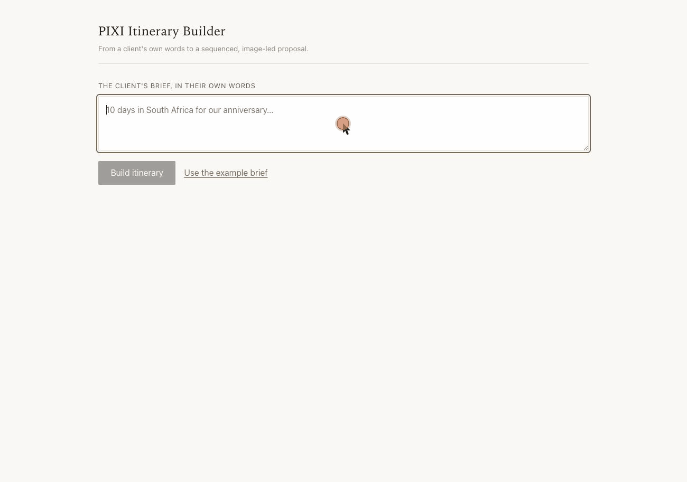

# PIXI Itinerary Builder

Turns a travel designer's client brief into a sequenced, imagery-rich
luxury itinerary drawn from PIXI's supplied hotel catalogue.

Built for the PIXI AI Product Engineer take-home exercise. The product
reasoning — what was considered, what was chosen, and why — is in
[`docs/APPROACH.md`](docs/APPROACH.md). A running build journal is in
[`BUILD_LOG.md`](BUILD_LOG.md).

> **Status: the core journey works end to end.** A designer pastes a brief,
> gets back a priced, image-led itinerary, adjusts it, and previews it as
> the client would see it.

## Demo

From a client brief to a grounded itinerary, one deterministic edit, and the
client-facing preview.

Changing nights recomputes prices and day ranges immediately without another
model call.



## What it does

A designer pastes the client's own words — *"10 days in South Africa for
our anniversary, a few days in Cape Town, some time in the winelands, then
safari to finish"* — and gets back a sequenced, image-led itinerary they
can adjust and then present to the client.

Edits are recomputed deterministically — no second model call — so day
ranges, subtotals and the total update immediately. A view toggle shows the
same itinerary as the client would receive it.

The journey:

```text
client brief
  → the model proposes a grounded itinerary
  → deterministic validation and pricing
  → the designer reviews
  → change nights / replace a hotel
  → client-facing preview
```

The model handles judgement and language: interpreting the brief, choosing
properties, sequencing stops, allocating nights, and writing the rationale
and narrative. It may propose planning values such as nights per stop.

It does not author derived prices, distances, transfer durations, or
calculated totals. Those come from deterministic Python or directly from
supplied dataset fields, and every hotel referenced is validated against
the supplied catalogue. The boundary is enforced by the schema rather than
by instruction: the model's response has no field a price could occupy.

## Stack

- **Backend** — Python 3.9, FastAPI
- **Frontend** — React + TypeScript (Vite)
- **LLM** — Anthropic API
- **Data** — `data/hotels.json`, 12 luxury properties across five
  countries, supplied with the exercise and committed unmodified

The brief requires a Python backend and a React + TypeScript frontend.
FastAPI and Vite are our choices — see
[`docs/APPROACH.md`](docs/APPROACH.md).

## Prerequisites

- Python 3.9 or later
- Node 18 or later
- An Anthropic API key, for generating itineraries

## Setup

Four steps, run from the repository root: **1** configure → **2** validate →
**3** backend → **4** frontend.

### 1. Clone and configure

```bash
git clone <repo-url>
cd pixi-itinerary
cp .env.example .env
# Add your Anthropic API key to .env:
# ANTHROPIC_API_KEY=sk-ant-...
```

The key is read by the backend only. `load_dotenv()` finds this root `.env`
whichever directory the server starts from, so it does not matter that the
backend runs from `backend/`.

### 2. Validate the supplied dataset

The hotel data is committed — there is no download or seed step. Confirm it
loads cleanly:

```bash
python3 data/validate.py
# expected: OK: 12 hotels across 5 countries — all valid.
```

### 3. Start the backend

```bash
# Terminal 1 — from the repository root
cd backend
python3 -m venv .venv
source .venv/bin/activate
pip install -r requirements.txt

pytest                          # optional — 88 tests, no key or network

uvicorn app.main:app --reload
```

`pytest` is optional: it verifies the deterministic core and needs neither a
key nor a network, so it is the fastest confirmation the logic is sound — but
the app runs without it. `uvicorn` starts the API on `http://localhost:8000`.
Confirm it came up and the catalogue loaded:

```bash
curl -s localhost:8000/api/health
# {"status":"ok","hotels":12,"regions":[...],"planner_configured":true}
```

`planner_configured: true` confirms `ANTHROPIC_API_KEY` was found. If it
reads `false`, the app still loads but itinerary generation will fail — set
the key in `.env` and restart.

### 4. Start the frontend

```bash
# Terminal 2 — from the repository root, with the backend running
cd frontend
npm install
npm run dev
```

Open the app at **http://localhost:5173**.

The dev server is pinned to port 5173 because the backend's CORS allowlist
names it. If the port is taken, Vite fails rather than moving to another one
where API calls would be silently blocked. `VITE_API_BASE_URL` overrides the
backend origin; it defaults to `http://localhost:8000`.

## API

| Method | Path | |
|---|---|---|
| `GET` | `/api/health` | Catalogue size, supported regions, whether a key is configured |
| `POST` | `/api/itineraries` | A brief in, an itinerary out. Returns 200 with an unsupported-brief response when the catalogue cannot serve the destination — that is a product outcome, not an error |
| `POST` | `/api/itineraries/recompute` | Designer edits — change nights, replace a hotel. Deterministic; no model call |

Interactive docs at `http://localhost:8000/docs`.

## Environment variables

See [`.env.example`](.env.example). `.env` is gitignored and must never be
committed.

| Variable | Required | Purpose |
|---|---|---|
| `ANTHROPIC_API_KEY` | yes | Interpreting the brief and generating the itinerary |
| `VITE_API_BASE_URL` | no | Backend origin for the frontend. Defaults to `http://localhost:8000` |

## Repository layout

```text
backend/      FastAPI application and deterministic logic
frontend/     React + TypeScript application
data/         Supplied PIXI dataset + validate.py           (read-only)
docs/         Product narrative and demo assets
AGENTS.md     Working agreement for AI coding agents
CLAUDE.md     Imports AGENTS.md — Claude Code's entry point
BUILD_LOG.md  Build journal and time log
```
